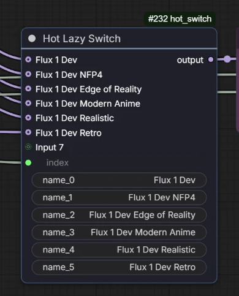
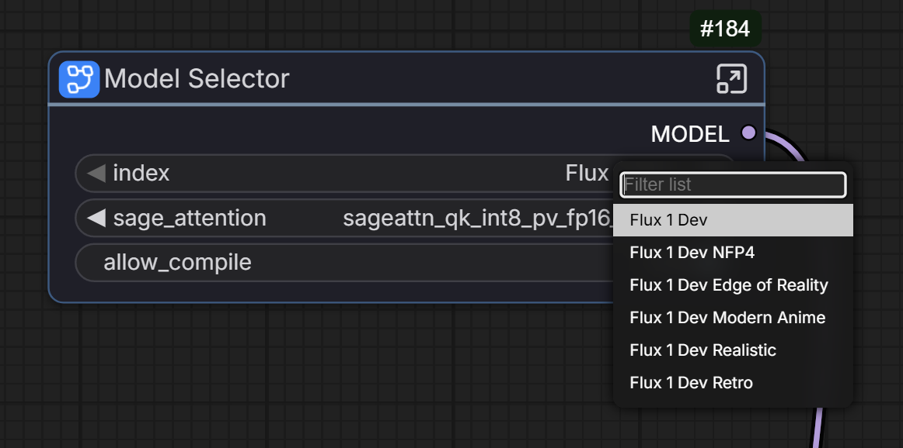
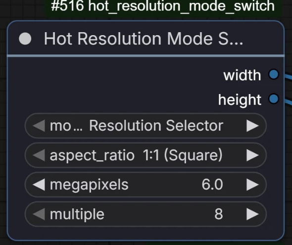
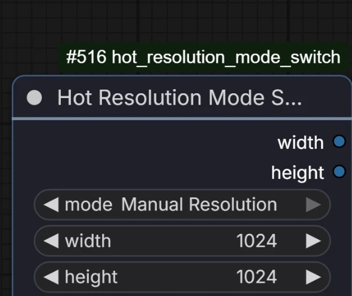

# ComfyUI-HotSwitches

I kept doing the same annoying thing in ComfyUI: wanting to try a different
model's variations or a different model altogether, or a different resolution, 
and ending up either rewiring a tangle of
noodles or keeping five slightly-different copies of the same workflow around
just so I could run A/B tests on something. These two nodes exist so I could stop doing
that. Pick from a dropdown, keep working.

## Nodes

### Hot Lazy Switch



Plug in up to 10 things of any type - models, images, conditioning, whatever
- give each one a name, and pick which one feeds downstream from a single
dropdown. The unpicked branches don't just get ignored, they don't run at
all, so you're not paying the load/compute cost for every option every time,
only the one you're actually using.

Sockets show up one at a time as you connect them, so the node isn't a wall
of ten empty inputs on day one. Unplug something and its socket stays put
rather than shuffling everything below it around.

The selector is a dropdown rather than a raw index, so promoting it into a
subgraph input still shows real names to pick from instead of a bare number:



### Hot Resolution Mode Switch

 

For when you want the convenience of an aspect-ratio + megapixel resolution
picker most of the time, but still want to drop in exact numbers sometimes.
One dropdown flips the node between:

- **Resolution Selector** - pick an aspect ratio and a target megapixel
  count, it does the math (same formula as ComfyUI's own built-in Resolution
  Selector node).
- **Manual Resolution** - just type the width and height yourself.

Only the controls for whichever mode you're in are shown, so the node isn't
cluttered with fields you're not using.

## Installation

**Via ComfyUI-Manager:** open Manager -> Install via Git URL -> paste
`https://github.com/Bloodwolfb/ComfyUI-HotSwitches.git` -> restart ComfyUI.

**Manually:** clone into your ComfyUI `custom_nodes` folder and restart:

```bash
cd ComfyUI/custom_nodes
git clone https://github.com/Bloodwolfb/ComfyUI-HotSwitches.git
```

No extra Python dependencies required.

## Requirements

Both nodes use ComfyUI's V3 node schema (`comfy_api.latest.io`), so they need
a reasonably current ComfyUI build that ships that API.

## License

MIT - see [LICENSE](LICENSE).
